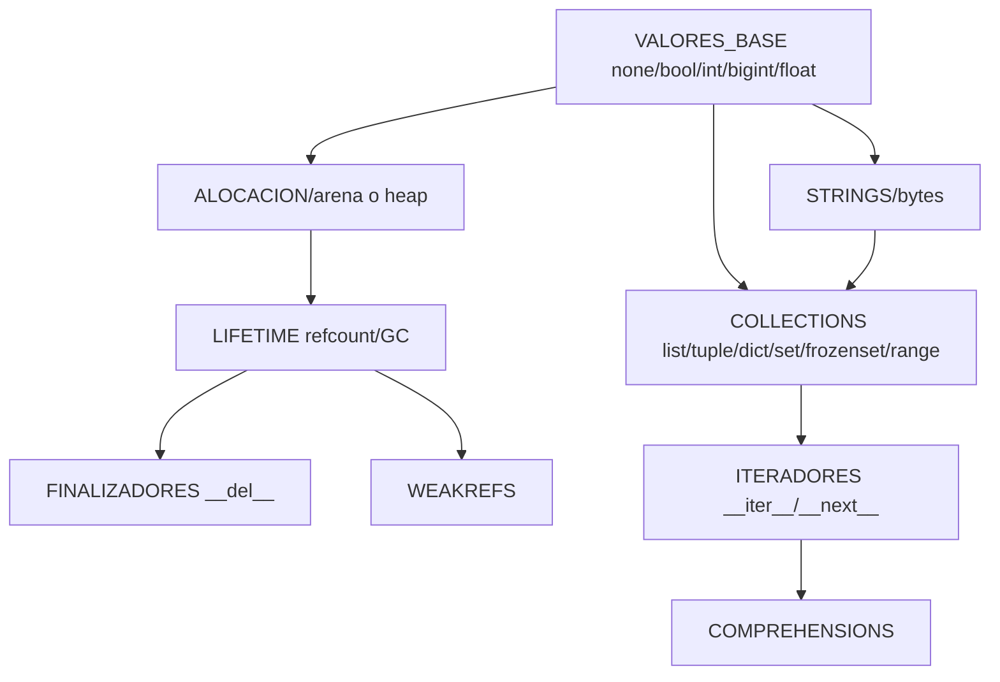
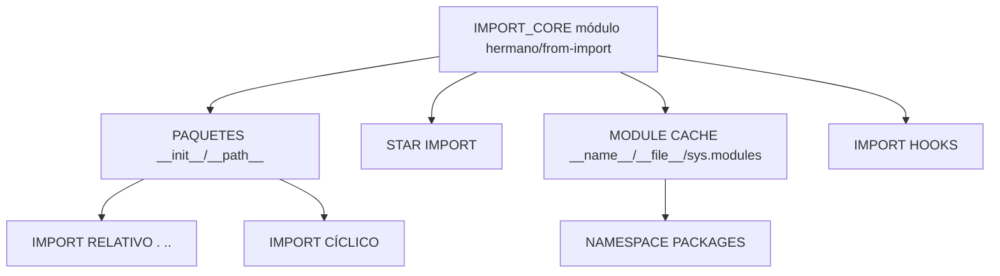

# PITÓN — Grafo de Dependencias de Paridad (CPython 3.12)

> Autoridad de orden. Un agente debe poder elegir trabajo realmente desbloqueado.
> Un gate cuyo requisito no está `PASS` está `BLOCKED` (no "en progreso").

Convención: `X → Y` significa "X depende de Y" (Y debe cerrarse antes de X).
Se usa textual/mermaid. `[R]` = requerido por el runtime.

## 1. Capas del runtime (dependencias base)



Cadena crítica de frames:


No implementar async independientemente de semántica de frames si la
arquitectura lo requiere (así es: coroutines = generadores + event loop).

## 2. Object model

```mermaid
graph TD
  OB0[OBJETO BÁSICO identidad/igualdad] --> OB1[ATTRIBUTE_LOOKUP]
  OB1 --> OB2[HERENCIA/MRO]
  OB2 --> OB3[super]
  OB1 --> OB4[DESCRIPTORES __get__/__set__/__delete__/__set_name__]
  OB4 --> OB5[PROPERTIES]
  OB4 --> OB6[classmethod/staticmethod]
  OB1 --> OB7[__getattribute__/__getattr__/__setattr__]
  OB2 --> OB8[SLOTS]
  OB7 --> OB9[METACLASES __new__/__call__/type(...)]
```

## 3. Imports



## 4. Orden de implementación recomendado (no "checkbox fáciles")

Criterio: (1) desbloquea muchos descendientes, (2) importancia semántica,
(3) testabilidad, (4) estabilidad arquitectónica, (5) reuso,
(6) impacto cross-platform.

1. `FRAME_MODEL_V1` — base de closures y control no local.
2. `OBJECT_PROTOCOL_V2` (attribute lookup + herencia + MRO).
3. `EXCEPTION_UNWIND_V2` (re-raise, `from`, cadenas).
4. `ITERATOR_PROTOCOL_V1`.
5. `GENERATOR_SUSPEND_FRAME_V1`.
6. `IMPORT_PACKAGE_V1`.
7. `DESCRIPTORS_V1`.
8. `ASYNC_LANG_V1` (coroutines sobre generators).
9. `STDLIB_TIER1_V1`.
10. `INTROSPECTION_V1` / `DYNAMIC_CODE_V1`.

Ver detalle de gates en `PITON_CPYTHON_3_12_MASTER_ROADMAP.md`.

## 5. Dependencias de rutas de mayor riesgo

| Cambio | Riesgo |
|---|---|
| Nuevo modelo de frames | colisiona con closures, generators, coroutines |
| Cambio de object-layout | rompe attributes, descriptors, metaclasses |
| Cambio de ABI/calling-convention | rompe ambos backends |
| Cambio de GC | rompe lifetime, finalizadores, weakrefs |

Antes de cualquiera de esos: marcar `ARCHITECTURE_REVIEW_REQUIRED` y detenerse.
Ver §"Stop conditions" del roadmap maestro.